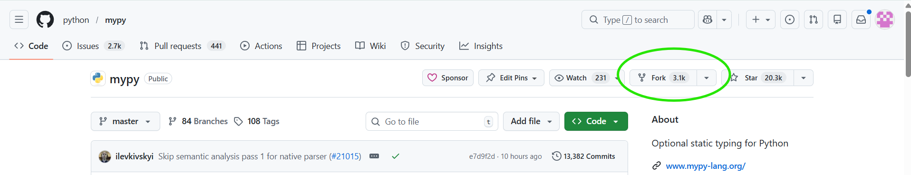
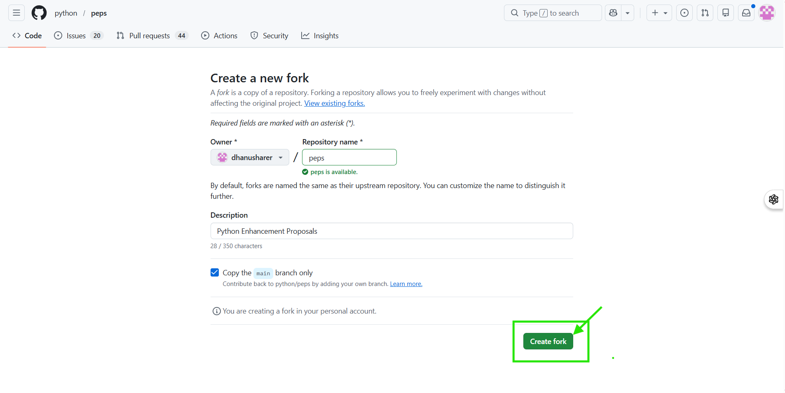
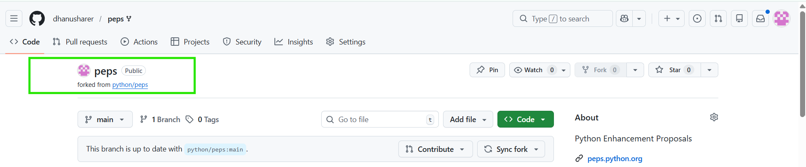

# 📸 Guide 01 — Forking a Repository

> **Time to complete:** ~5 minutes
> **Difficulty:** ⭐☆☆☆☆ Absolute beginner

---

## What You'll Learn

By the end of this guide you'll know:
- What a fork is and why you need one
- How to fork a repo in 3 clicks
- How to verify your fork was created correctly

---

## What Is a Fork?

When you find an open source project you want to contribute to, you can't push changes directly to it — you don't have write access. A **fork** creates your own personal copy of the project under your GitHub account.

```
Original Repo                       Your Fork
github.com/torvalds/linux    →     github.com/yourname/linux
        ↑                                    ↑
  (you can't edit this)            (you fully own this)
```

Forks are visible to everyone on GitHub. They're a normal, expected part of open source collaboration — maintainers love seeing their project forked!

---

## Step-by-Step: Forking

### Step 1 — Find the Repository


Navigate to the repository you want to fork. For this walkthrough, use the practice repository:

```
https://github.com/[REPO-OWNER]/first-contribution-sample

```

> 📍 **Where to look:** Top-right area of the repository page. The **Fork** button shows how many times the repo has been forked.

---

### Step 2 — Click "Fork"

After clicking Fork, GitHub shows you a dialog:



**Options explained:**
- **Owner:** Select your personal account (not an organization, unless intended)
- **Repository name:** Keep the same name — this is the convention
- **Copy the main branch only:** ✅ Keep this checked for most contributions

Click **"Create fork"**.

---

### Step 3 — Wait for GitHub to Copy the Repo

You'll see a brief loading screen:

```
┌──────────────────────────────────────────────┐
│                                              │
│          Forking octocat/Hello-World...      │
│                                              │
│              🍴  ⟶  ⟶  ⟶  📁              │
│                                              │
└──────────────────────────────────────────────┘
```

This usually takes 2–10 seconds.

---

### Step 4 — Confirm Your Fork Was Created

You'll be redirected to your fork. Check that:

✅ **The URL shows YOUR username:**
```
https://github.com/YOUR-USERNAME/Hello-World
```
(Not `octocat/Hello-World`)

✅ **You see the "forked from" notice:**
```


```

✅ **The content matches the original repo**

---

## ✅ Checkpoint

After completing this guide, you should have:

- [ ] Found a repository to contribute to
- [ ] Clicked Fork and selected your account
- [ ] Verified your fork URL shows YOUR username
- [ ] Seen the "forked from" notice on your fork

---

## 🚀 Next Step

Proceed to **[Guide 02 — Cloning and Setup](./02-cloning-setup.md)** to download your fork to your computer.

---

## ❓ Troubleshooting

**Q: I don't see a Fork button.**
A: You might already have forked this repo. Check your profile → Repositories for an existing fork.

**Q: The Fork button is grayed out.**
A: You might be viewing one of your own repositories. You can't fork your own repos.

**Q: My fork is missing files the original has.**
A: This can happen if you unchecked "Copy main branch only" and the files are on `main`. Try re-forking, or use `git fetch upstream` after cloning.