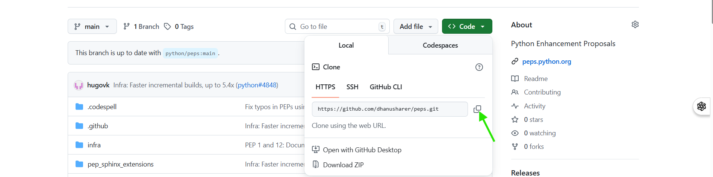
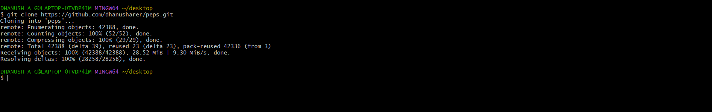

# 💻 Guide 02 — Cloning and Initial Setup

> **Time to complete:** ~10 minutes
> **Difficulty:** ⭐⭐☆☆☆ Beginner
> **Prerequisite:** Complete [Guide 01 — Forking](./01-forking-guide.md) first

---

## What You'll Learn

- How to install Git (if needed)
- How to clone your fork to your computer
- How to configure Git with your identity
- How to connect your local repo to the original "upstream" repo

---

## Prerequisites Check

Open your terminal and run these checks:

```bash
# Check if Git is installed
git --version
```

**If you see something like `git version 2.39.2` → ✅ Git is installed!**

**If you see `command not found` → Install Git:**

| Operating System | Instructions |
|-----------------|-------------|
| **macOS** | Run `xcode-select --install` in Terminal, or download from [git-scm.com](https://git-scm.com/downloads) |
| **Windows** | Download Git for Windows from [git-scm.com](https://git-scm.com/downloads). During install, keep all defaults. Use "Git Bash" as your terminal. |
| **Ubuntu/Debian Linux** | Run `sudo apt install git` |
| **Fedora/RHEL Linux** | Run `sudo dnf install git` |

---

## Step 1 — Configure Git With Your Identity

Git needs to know who you are to label your commits. You only do this once.

```bash
# Set your name (use the name you want to appear on commits)
git config --global user.name "Jane Doe"

# Set your email (use the same email as your GitHub account)
git config --global user.email "jane@example.com"

# Verify your settings
git config --global --list
```

**Expected output:**
```
user.name=Jane Doe
user.email=jane@example.com
```

> 💡 **Tip:** Use the same email as your GitHub account so your commits are linked to your profile and show your contribution graph.

---

## Step 2 — Get Your Fork's URL

Go to **your fork** on GitHub (not the original):

```
### Step 2 — Get Your Fork's URL


### Step 3 — Clone the Repository


```

Click the green **Code** button:

```


```

Make sure **HTTPS** is selected (easier for beginners). Click the clipboard icon to copy the URL.

---

## Step 3 — Clone the Repository

Open your terminal. Navigate to where you want to store the project:

```bash
# Go to your home directory (a safe place to start)
cd ~

# Or create a dedicated projects folder:
mkdir projects
cd projects
```

Now clone:

```bash
# Paste the URL you copied from GitHub
git clone https://github.com/YOUR-USERNAME/REPO-NAME.git
```

**Full example:**
```bash
git clone https://github.com/janedoe/Hello-World.git
```

**Expected output:**
```
Cloning into 'Hello-World'...
remote: Enumerating objects: 15, done.
remote: Counting objects: 100% (15/15), done.
remote: Compressing objects: 100% (10/10), done.
remote: Total 15 (delta 2), reused 14 (delta 1), pack-reused 0
Receiving objects: 100% (15/15), 4.23 KiB | 1.06 MiB/s, done.
Resolving deltas: 100% (2/2), done.
```

---

## Step 4 — Enter the Project Folder

```bash
cd Hello-World

# Confirm you're in the right place
ls
```

You should see the project's files listed.

---

## Step 5 — Add the Upstream Remote

The **upstream** remote connects your local copy to the original repo, so you can pull in future updates.

```bash
# Add the upstream remote
# Replace ORIGINAL-OWNER with the actual owner's GitHub username
git remote add upstream https://github.com/ORIGINAL-OWNER/REPO-NAME.git
```

Verify both remotes are set up:

```bash
git remote -v
```

**Expected output:**
```
origin    https://github.com/YOUR-USERNAME/REPO-NAME.git (fetch)
origin    https://github.com/YOUR-USERNAME/REPO-NAME.git (push)
upstream  https://github.com/ORIGINAL-OWNER/REPO-NAME.git (fetch)
upstream  https://github.com/ORIGINAL-OWNER/REPO-NAME.git (push)
```

| Remote | Points to | You can push? |
|--------|-----------|--------------|
| `origin` | Your fork | ✅ Yes |
| `upstream` | Original repo | ❌ No |

---

## Step 6 — Open in Your Editor

```bash
# VS Code:
code .

# Sublime Text:
subl .

# Or just list files to confirm everything looks right:
ls -la
```

---

## Understanding the File Structure

Most open source projects follow a similar layout:

```
REPO-NAME/
├── README.md          ← Start here — project description and setup
├── CONTRIBUTING.md    ← How to contribute (read before PRs!)
├── LICENSE            ← Legal terms of use
├── .gitignore         ← Files Git should ignore (logs, secrets, etc.)
├── src/               ← Source code
├── tests/             ← Test files
└── docs/              ← Documentation
```

> 📖 **Always read `README.md` and `CONTRIBUTING.md`** before making any changes. Many projects have specific requirements.

---

## ✅ Checkpoint

After completing this guide, you should have:

- [ ] Git installed and configured with your name and email
- [ ] Cloned your fork to your computer
- [ ] Navigated into the project folder
- [ ] Added the upstream remote
- [ ] Verified both `origin` and `upstream` appear in `git remote -v`

---

## 🚀 Next Step

Proceed to **[Guide 03 — Creating a Feature Branch](./03-branching.md)**.

---

## ❓ Troubleshooting

**Q: `git clone` asks for a username and password.**
A: GitHub no longer accepts passwords for Git operations. You need a Personal Access Token (PAT):
- Go to GitHub → Settings → Developer settings → Personal access tokens → Generate new token
- Give it `repo` scope and copy the token
- Use the token as your "password" when Git prompts you

**Q: I see `fatal: destination path already exists`.**
A: A folder with that name already exists. Either delete it or clone into a different directory.

**Q: My terminal shows a different path after `cd ~`.**
A: That's normal — your home directory is wherever Git Bash or your terminal puts you. You can use `pwd` to see your current location.