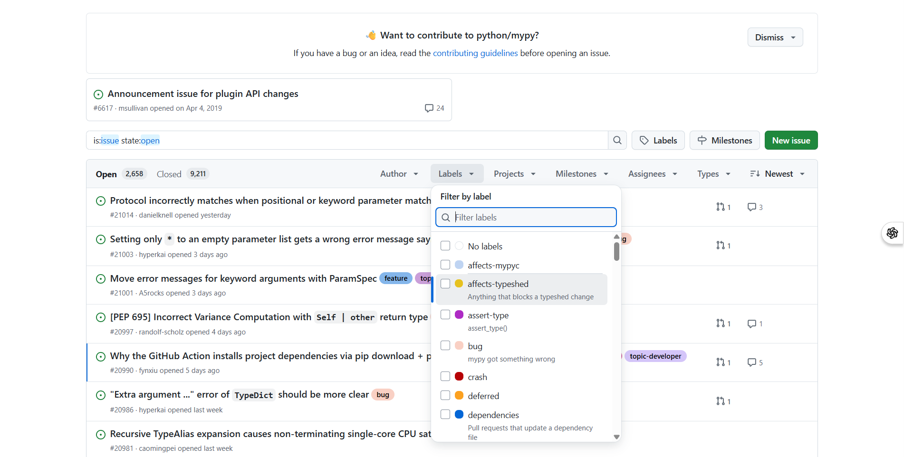
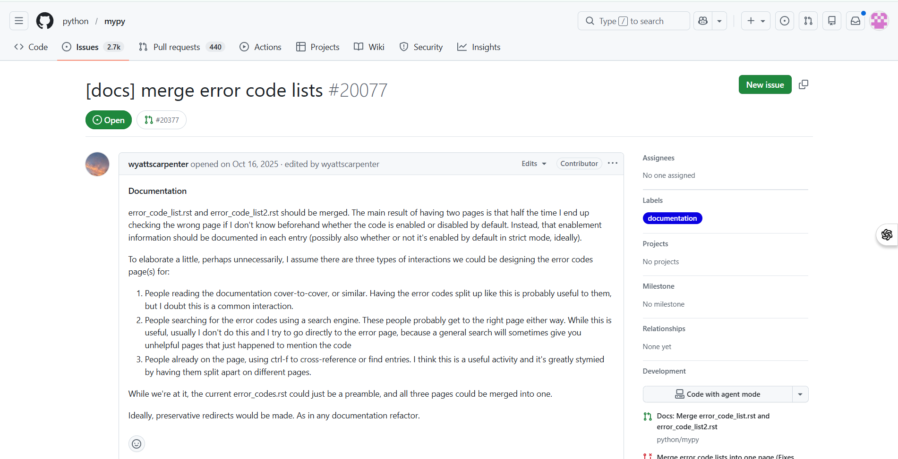
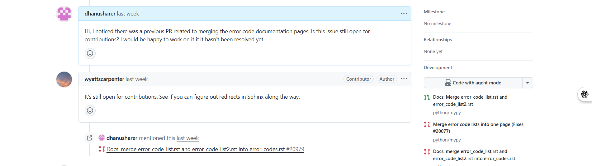
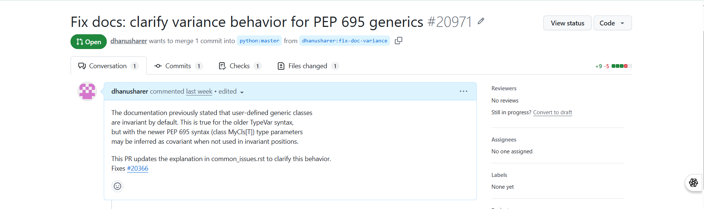

# 🔍 Guide 05 — Finding and Solving Issues

> **Time to complete:** ~20 minutes
> **Difficulty:** ⭐⭐⭐☆☆ Beginner-Intermediate
> **Prerequisite:** Complete [Guide 04 — Making Changes](./04-making-changes.md) first

---

## What You'll Learn

- Where to find beginner-friendly issues
- How to read and understand an issue
- How to claim an issue before starting work
- How to reproduce a bug yourself
- How to plan and implement your fix
- How to link your PR back to the issue

---

## Step 1 — Where to Find Issues

### On GitHub Directly

Every repository has an **Issues** tab. Look for these beginner-friendly labels:
```
┌─────────────────────────────────────────────────────────────┐
│  Issues   Pull Requests   Actions                           │
│                                                             │
│  Labels ▾   [good first issue]  [beginner]  [help wanted]  │
│             [easy]  [starter]   [up-for-grabs]              │
│                      ↑                                      │
│         Filter by these labels to find beginner tasks       │
└─────────────────────────────────────────────────────────────┘
```

**How to filter:**
1. Go to the repo → click **Issues** tab
2. Click **Labels** dropdown
3. Select `good first issue` or `help wanted`

<!-- Screenshot: Issues tab with label filter open -->


---

### External Platforms

If you don't have a specific repo in mind, these sites
aggregate beginner issues across all of GitHub:

| Platform | URL | Best for |
|----------|-----|---------|
| Good First Issues | [goodfirstissues.com](https://goodfirstissues.com) | Any language |
| Up For Grabs | [up-for-grabs.net](https://up-for-grabs.net) | Curated projects |
| CodeTriage | [codetriage.com](https://www.codetriage.com) | Daily email digest |
| GitHub Explore | [github.com/explore](https://github.com/explore) | Trending repos |
| First Contributions | [firstcontributions.github.io](https://firstcontributions.github.io) | Practice only |

---

## Step 2 — Reading an Issue Properly

Before touching any code, read the issue carefully.
A well-written issue looks like this:
```
┌─────────────────────────────────────────────────────────────┐
│  Bug: App crashes when CSV file is empty          #42       │
│                                                             │
│  Opened by: @username  •  Label: good first issue          │
│                                                             │
│  Description                                               │
│  ─────────────                                             │
│  When a user uploads an empty CSV file, the app throws     │
│  an unhandled ValueError instead of showing an error msg.  │
│                                                             │
│  Steps to reproduce                                        │
│  ──────────────────                                        │
│  1. Go to /import                                          │
│  2. Upload an empty .csv file                              │
│  3. Click Submit                                           │
│                                                             │
│  Expected: Show "File is empty" error message              │
│  Actual: ValueError: No columns to parse from file         │
│                                                             │
│  Environment: Python 3.11, macOS                           │
└─────────────────────────────────────────────────────────────┘
```

**Questions to ask yourself while reading:**

- [ ] Do I understand exactly what the bug or feature is?
- [ ] Do I know where in the codebase this likely lives?
- [ ] Has anyone else already commented they're working on it?
- [ ] Is there enough information to get started?

> 💡 If the issue is unclear, **ask for clarification in a comment**
> before starting. Maintainers appreciate this — it shows you're
> thoughtful.

<!-- Screenshot: A real GitHub issue page with labels and description -->


---

## Step 3 — Claiming the Issue

**Always comment on an issue before starting work.**
This prevents two people solving the same thing simultaneously.

Post a short comment like:
```
Hi! I'd like to work on this issue. I'm a beginner but I think
I understand what needs to be fixed. I'll have a PR ready
within a few days. Please let me know if there's anything
specific I should keep in mind!
```

Then wait for a maintainer to respond or assign it to you:
```
┌─────────────────────────────────────────────────────────────┐
│  ✅ maintainer-alice commented:                             │
│                                                             │
│  "Sure, go ahead! Let us know if you need any help."       │
│                                                             │
│  Assignees: @yourname                                       │
└─────────────────────────────────────────────────────────────┘
```

> ⚠️ **Don't open a PR without commenting first.** Maintainers
> may already have someone working on it privately, or may want
> to discuss the approach before you invest time coding.

<!-- Screenshot: Comment box on a GitHub issue -->


---

## Step 4 — Reproduce the Bug First

**Never fix what you can't see.**
Before writing any code, confirm you can reproduce the problem.
```bash
# Make sure you're on a fresh branch
git checkout main
git pull upstream main
git checkout -b fix/empty-csv-crash

# Set up environment
python -m venv venv
source venv/bin/activate     # Windows: venv\Scripts\activate
pip install -r requirements.txt

# Try to trigger the bug yourself
python app.py
# Follow the steps in the issue...
```

Once you see the same error the issue describes — you're ready.

> 💡 If you **can't reproduce** the bug, comment on the issue
> saying so. Include your environment details (OS, Python version).
> It may be platform-specific or already fixed.

---

## Step 5 — Locate the Relevant Code

Search the codebase for files related to the issue:
```bash
# Search for a keyword related to the bug
grep -r "parse_csv" .
grep -r "ValueError" .
grep -r "empty" . --include="*.py"

# Or use VS Code's search: Ctrl + Shift + F
```

**What to look for:**
```
project/
├── app.py              ← entry point, check here first
├── utils/
│   └── csv_parser.py   ← likely where the bug lives
├── tests/
│   └── test_parser.py  ← tests to update after fixing
```

---

## Step 6 — Plan Before You Code

Write out your approach in plain English before touching anything:
```
Problem:
  parse_csv() throws ValueError when file is empty

Root cause:
  No check for empty file before calling pandas.read_csv()

Fix:
  Add an early return at the top of parse_csv() that checks
  if file size is 0 and returns an empty list with a
  user-friendly error message

Files to change:
  - utils/csv_parser.py  (add the check)
  - tests/test_parser.py (add test for empty file case)
```

> 💡 If the fix is complex, **post your plan as a comment on the
> issue** and ask if the approach looks right before coding.
> Saves everyone time if the maintainer has a different idea.

---

## Step 7 — Implement the Fix

Make small, focused changes:
```python
# utils/csv_parser.py — BEFORE
def parse_csv(file):
    df = pd.read_csv(file)   # crashes if file is empty
    return df.to_dict()

# utils/csv_parser.py — AFTER
def parse_csv(file):
    # Handle empty file gracefully
    if file.size == 0:
        return [], "File is empty. Please upload a valid CSV."
    df = pd.read_csv(file)
    return df.to_dict(), None
```

Commit as you go — don't wait until everything is done:
```bash
git add utils/csv_parser.py
git commit -m "fix: add empty file check in parse_csv"

git add tests/test_parser.py
git commit -m "test: add test case for empty CSV upload"
```

---

## Step 8 — Verify Your Fix Works
```bash
# Run the full test suite
python -m pytest

# Run just the relevant test file
python -m pytest tests/test_parser.py -v

# Manually test the exact steps from the issue
python app.py
# Upload empty CSV → should now show friendly error, not crash
```

**Expected output after fix:**
```
===================== test session starts ======================
collected 12 items

tests/test_parser.py::test_empty_csv  PASSED             [ 8%]
tests/test_parser.py::test_valid_csv  PASSED             [16%]
...
===================== 12 passed in 0.43s =======================
```

---

## Step 9 — Link Your PR to the Issue

When you open your PR, reference the issue number in the
description. GitHub will automatically close the issue
when the PR is merged:
```markdown
## What does this PR do?
Fixes a crash when an empty CSV file is uploaded.

Closes #42
```

**Magic keywords that auto-close issues on merge:**

| Keyword | Example |
|---------|---------|
| `Closes` | `Closes #42` |
| `Fixes` | `Fixes #42` |
| `Resolves` | `Resolves #42` |

<!-- Screenshot: PR description with Closes #42 linking to issue -->


---

## What Happens After Your PR is Merged?
```
┌─────────────────────────────────────────────────────────────┐
│  🟣 Merged — your fix is now part of the project!          │
│                                                             │
│  Issue #42 ←─────────────────── auto-closed ✅             │
│                                                             │
│  🎉 You just made real users' lives better!                │
└─────────────────────────────────────────────────────────────┘
```

---

## ✅ Checkpoint

After completing this guide, you should have:

- [ ] Found a `good first issue` to work on
- [ ] Commented on the issue to claim it
- [ ] Reproduced the bug locally
- [ ] Located the relevant files in the codebase
- [ ] Planned your fix before coding
- [ ] Implemented and tested the fix
- [ ] Used `Closes #42` in your commit or PR description

---

## ⚠️ Common Pitfalls

| Pitfall | Fix |
|---------|-----|
| Starting work without claiming | Always comment first |
| Can't reproduce the bug | Comment on issue with your environment details |
| Fix is too broad | Stick to exactly what the issue describes |
| Forgot to update tests | Check for a `tests/` folder — always update it |
| Issue was already closed | Check issue status before starting |
| No response after claiming | Wait 3–5 days, then politely follow up |

---

## 🚀 Next Step

You've found, claimed, and solved an issue — now it's time to
propose your changes officially.

Proceed to **[Guide 06 — Opening a Pull Request](./06-pull-request.md)**